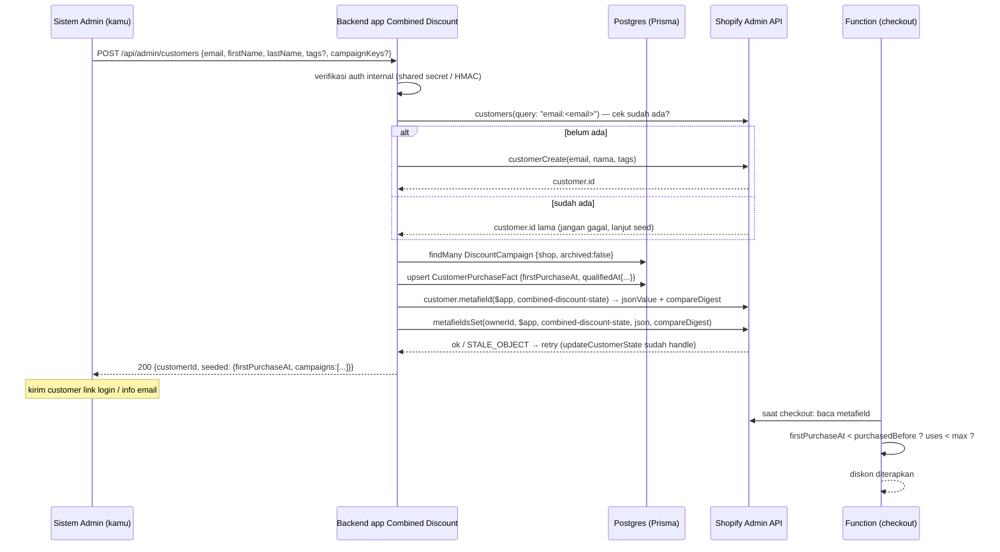

# Flow: Admin Create Customer → Otomatis Eligible Combined Discount

Dokumen ini menjelaskan apa yang **harus diketahui sistem admin** supaya customer
yang dibuat oleh admin langsung lolos gate eligibility di Function
`combined-discount`, tanpa perlu punya riwayat order sungguhan.

Tidak ada kode di sini yang harus dijalankan. Ini kontrak + urutan langkah.

---

## 1. Cara Function memutuskan "eligible"

Function **tidak punya flag `eligible: true`**. Eligibility diturunkan dari satu
customer metafield JSON yang dibaca saat checkout:

| Item | Nilai |
|---|---|
| Owner | `Customer` |
| Namespace | `$app` (app-reserved, milik app Combined Discount) |
| Key | `combined-discount-state` |
| Type | `json` |
| Akses admin | `merchant_read` → merchant dan app lain **tidak bisa menulis** |

Bentuk dokumen yang dibaca Rust (`extensions/combined-discount/src/cart_lines_discounts_generate_run.rs`, struct `CustomerState`):

```json
{
  "firstPurchaseAt": "YYYY-MM-DD",
  "campaigns": [
    { "key": "cd_xxxxxxxx", "qualifiedAt": "YYYY-MM-DD", "uses": 0 }
  ]
}
```

Dua gate yang dievaluasi (`customer_gates_block`):

| Gate | Config di discount | Syarat lolos |
|---|---|---|
| Purchase history | `customerEligibility.purchasedBefore` (`YYYY-MM-DD`, eksklusif) | `firstPurchaseAt < purchasedBefore`. Jika `requireQualifyingProducts = true`, yang dibandingkan adalah `campaigns[key].qualifiedAt`, bukan `firstPurchaseAt`. |
| Usage cap | `usageLimit.maxOrdersPerCustomer` | `campaigns[key].uses < max`. Customer baru otomatis lolos (uses = 0). |

Perbandingan dilakukan sebagai **string `YYYY-MM-DD`** (lexicographic). Tidak ada
jam, tidak ada timezone.

Kesimpulan: "auto eligible" = **menulis tanggal yang lebih awal dari cutoff** ke
metafield tersebut saat customer dibuat.

---

## 2. Empat constraint yang tidak boleh dilanggar

### 2.1 Hanya app ini yang bisa menulis metafield-nya

Namespace `$app` di-resolve ke app ID pemilik. Dikonfirmasi dari docs Shopify:
app-owned metafield "prevents modification by other apps or merchants", dan
`MERCHANT_READ` berarti "No other apps have access".

Akibatnya:

- Sistem admin **tidak boleh** pakai token custom app lain / Admin API token
  dari "Develop apps" untuk menulis metafield ini. Akan ditolak atau menulis ke
  namespace app yang salah.
- Semua penulisan harus lewat **backend app Combined Discount** (Fly.io,
  `combined-discount-shopify.fly.dev`) memakai session offline app ini.
- Jadi sistem admin memanggil **endpoint baru di app ini**, bukan Shopify
  langsung.

### 2.2 Database app adalah source of truth, metafield hanya proyeksi

Webhook `orders/create` (`app/lib/purchase-projection.server.js`, fungsi
`projectOrder`) menghitung ulang metafield dari tabel Prisma
`CustomerPurchaseFact` + order yang masuk, lalu **menimpa `firstPurchaseAt`**.

Kalau admin hanya menulis metafield tanpa menulis row di DB:

1. Customer dibuat, metafield diisi `firstPurchaseAt = 2000-01-01`. Eligible.
2. Customer checkout pertama kali dengan diskon. Order masuk.
3. Webhook mencari `CustomerPurchaseFact` → tidak ada → `firstPurchaseAt`
   dihitung dari order ini saja → misalnya `2026-09-07`.
4. Metafield ditimpa. Customer **kehilangan eligibility setelah order pertama**.

Maka seeding **wajib menulis dua tempat**, DB dulu baru metafield:

| Target | Field | Nilai |
|---|---|---|
| `CustomerPurchaseFact` | `firstPurchaseAt` | tanggal seed (lihat 3.3) |
| `CustomerPurchaseFact` | `qualifiedAt` | JSON `{ "<campaignKey>": "<tanggal seed>" }` untuk setiap campaign aktif |
| Metafield | `firstPurchaseAt` | tanggal seed |
| Metafield | `campaigns[]` | satu entry per campaign aktif dengan `qualifiedAt` |

`projectOrder` memakai `earlierDay(existing, orderDay)`, jadi tanggal seed yang
lebih awal akan **bertahan** setelah order sungguhan masuk. Ini pola yang sama
dengan backfill (`purchase-backfill.server.js` menulis DB sebelum metafield
dengan alasan persis ini).

### 2.3 Backfill segment tidak akan pernah menemukan customer buatan admin

Backfill memakai ShopifyQL segment `first_order_date < <cutoff>`. Customer
tanpa order tidak punya `first_order_date`, jadi tidak pernah masuk segment.

Konsekuensi: kalau merchant **membuat campaign baru** setelah customer dibuat,
dan campaign itu memakai `requireQualifyingProducts = true`, customer buatan
admin tidak akan punya `campaigns[keyBaru].qualifiedAt` → diblokir.

Pilihan (pilih satu, tulis di keputusan produk):

- **Direkomendasikan:** campaign yang ditujukan untuk customer buatan admin
  memakai `requireQualifyingProducts = false`. Gate hanya melihat
  `firstPurchaseAt`, yang sudah di-seed sekali dan berlaku untuk semua campaign,
  sekarang dan nanti.
- Alternatif: sediakan aksi "re-grant" di sistem admin yang menjalankan ulang
  seeding untuk semua customer buatan admin setiap ada campaign baru.
  Butuh penanda customer buatan admin (lihat 3.4).

### 2.4 Customer harus login saat checkout

Function membaca `cart.buyerIdentity.customer`. Cart anonim → `has_customer =
false` → **diblokir** (bukan diloloskan) selama salah satu gate aktif.

Sistem admin harus tahu:

- Email yang dipakai admin saat create harus **sama persis** dengan email yang
  dipakai customer untuk login di storefront.
- Dengan **new customer accounts**, customer login pakai kode OTP ke email
  tersebut. Tidak perlu password, tidak perlu invite.
- Dengan **legacy accounts**, customer perlu diundang
  (`customerSendAccountInviteEmail`) dan set password dulu. Cek jenis account
  toko sebelum memutuskan.
- Memasukkan email di kolom checkout tanpa login **tidak cukup** untuk mengisi
  `buyerIdentity.customer`.

---

## 3. Flow yang harus dijalankan



### 3.1 Langkah rinci

1. **Auth request admin → backend.** Endpoint ini bukan halaman embedded, jadi
   tidak bisa pakai `authenticate.admin`. Pakai shared secret di header
   (mis. `X-Admin-Secret`) atau HMAC body, disimpan di env Fly. Tanpa ini
   siapa pun bisa membuat customer eligible.
2. **Lookup by email dulu** (idempotent). `customerCreate` gagal dengan
   "Email has already been taken" kalau email sudah ada. Kalau sudah ada,
   tetap lanjut ke seeding, jangan return error.
3. **`customerCreate`.** Minimal `email`. Tambahkan `tags` penanda (lihat 3.4).
   Jangan kirim `metafields` di input `customerCreate` untuk `$app`; lebih
   aman lewat `metafieldsSet` dengan helper `updateCustomerState` yang sudah
   ada karena helper itu menangani compare-and-swap.
4. **Ambil daftar campaign aktif** dari `DiscountCampaign` (`shop`,
   `archived = false`). `campaignKey` adalah key yang dibaca Function.
   Boleh difilter ke `campaignKeys` yang dikirim admin.
5. **Upsert `CustomerPurchaseFact`** dengan `firstPurchaseAt` = tanggal seed dan
   `qualifiedAt` = map `{campaignKey: tanggalSeed}`. Gunakan `earlierDay` saat
   merge supaya tidak menimpa tanggal yang sudah lebih awal.
6. **Tulis metafield** via `updateCustomerState(admin, customerId, mutate)`.
   Di dalam `mutate`: set `firstPurchaseAt`, lalu `upsertCampaignState` per
   campaign dengan `{ qualifiedAt: tanggalSeed, uses: existing?.uses ?? 0 }`.
   `serializeCustomerState` otomatis membuang `uses: 0` dan campaign kosong,
   itu normal.
7. **Return** `customerId` + apa yang di-seed, supaya sistem admin bisa
   menampilkan/menyimpan.

### 3.2 Kontrak endpoint (usulan)

```
POST /api/admin/customers
X-Admin-Secret: <env ADMIN_API_SECRET>
Content-Type: application/json

{
  "email": "vip@example.com",
  "firstName": "Budi",
  "lastName": "Santoso",
  "tags": ["admin-created", "vip"],
  "campaignKeys": null,          // null = semua campaign aktif
  "seedDate": null               // null = default (lihat 3.3)
}

200
{
  "customerId": "gid://shopify/Customer/123",
  "created": true,               // false kalau email sudah ada
  "seeded": {
    "firstPurchaseAt": "2000-01-01",
    "campaigns": [{ "key": "cd_abc123", "qualifiedAt": "2000-01-01" }]
  }
}
```

Error yang harus dibedakan oleh sistem admin:

| HTTP | Arti | Aksi admin |
|---|---|---|
| 401 | secret salah | cek env |
| 422 | `userErrors` dari Shopify (email invalid, dsb.) | tampilkan pesan |
| 409 | tidak ada campaign aktif dengan cutoff | buat/simpan discount dulu |
| 500 | tulis DB/metafield gagal setelah retry | ulangi request, aman (idempotent) |

### 3.3 Tanggal seed: pakai sentinel, bukan "kemarin"

Backfill memakai `dayBefore(cutoff)` karena terikat ke cutoff tertentu, dan
sengaja fail-closed kalau cutoff berubah. Untuk customer buatan admin tujuannya
"selalu eligible", jadi pakai **tanggal sentinel tetap yang jauh di masa lalu**,
misalnya `2000-01-01`:

- Lolos untuk cutoff apa pun yang masuk akal, termasuk campaign yang dibuat
  belakangan (untuk gate `firstPurchaseAt`).
- `earlierDay` menjamin sentinel tidak tertimpa oleh order asli.
- Mudah dikenali di data sebagai "hasil grant admin", bukan tanggal order asli.

Kalau bisnis butuh cutoff per customer, kirim `seedDate` eksplisit. Syaratnya
tetap: harus **strictly lebih kecil** dari `purchasedBefore` campaign.

### 3.4 Penanda customer buatan admin

Tambahkan tag Shopify `admin-created` (atau sejenis) saat `customerCreate`.
Gunanya:

- Filter di Shopify admin dan segment.
- Dasar untuk aksi "re-grant" (2.3) kalau suatu saat dibutuhkan.
- Audit: membedakan `firstPurchaseAt = 2000-01-01` hasil grant dari data asli.

Opsi lanjutan (tidak wajib): tambah kolom `grantedAt DateTime?` di
`CustomerPurchaseFact` supaya proses pembuatan campaign baru bisa otomatis
menambahkan `qualifiedAt` untuk semua customer yang pernah di-grant.

---

## 4. Operasi Admin API yang dipakai

Semua sudah divalidasi ke schema Admin API live (2026-07). Scope
`write_customers` sudah ada di `shopify.app.toml`.

Lookup idempotent:

```graphql
query AdminFindCustomerByEmail($query: String!, $namespace: String!, $key: String!) {
  customers(first: 1, query: $query) {
    nodes {
      id
      email
      state: metafield(namespace: $namespace, key: $key) {
        jsonValue
        compareDigest
      }
    }
  }
}
```

Variabel: `query = "email:vip@example.com"`, `namespace = "$app"`,
`key = "combined-discount-state"`. Catatan: `Customer.email` sudah deprecated,
kalau mau future-proof pakai `defaultEmailAddress { emailAddress }`.

Create:

```graphql
mutation AdminCreateEligibleCustomer($input: CustomerInput!) {
  customerCreate(input: $input) {
    customer {
      id
      email
      tags
    }
    userErrors {
      field
      message
    }
  }
}
```

Variabel: `input = { email, firstName, lastName, tags: ["admin-created"] }`.

Seed metafield (sama persis dengan yang dipakai `customer-state.server.js`,
cukup panggil `updateCustomerState`):

```graphql
mutation AdminSeedCustomerState($metafields: [MetafieldsSetInput!]!) {
  metafieldsSet(metafields: $metafields) {
    metafields {
      key
      compareDigest
    }
    userErrors {
      field
      message
      code
    }
  }
}
```

Variabel:

```json
{
  "metafields": [{
    "ownerId": "gid://shopify/Customer/123",
    "namespace": "$app",
    "key": "combined-discount-state",
    "type": "json",
    "value": "{\"firstPurchaseAt\":\"2000-01-01\",\"campaigns\":[{\"key\":\"cd_abc123\",\"qualifiedAt\":\"2000-01-01\"}]}",
    "compareDigest": "<dari read sebelumnya, hilangkan kalau metafield belum ada>"
  }]
}
```

---

## 5. Cara verifikasi setelah seeding

1. Di Shopify admin → Customers → customer tsb → Metafields: pastikan
   `Combined Discount customer state` berisi `firstPurchaseAt` sentinel.
2. Di DB: `select * from "CustomerPurchaseFact" where "customerId" = '...'`
   harus ada row dengan `firstPurchaseAt` yang sama.
3. Login di storefront **dengan email yang sama**, tambah produk eligible,
   masukkan kode / pastikan automatic discount muncul di checkout.
4. Selesaikan satu order, tunggu webhook, cek ulang metafield: `firstPurchaseAt`
   **harus tetap** sentinel dan `campaigns[key].uses` naik jadi 1 (kalau
   campaign punya usage cap dan order memakai kode/title campaign).
5. Kalau langkah 4 mengubah `firstPurchaseAt` ke tanggal order, berarti row DB
   tidak tertulis (constraint 2.2 dilanggar).

---

## 6. Edge case yang harus ditangani sistem admin

| Kasus | Yang terjadi | Penanganan |
|---|---|---|
| Email sudah terdaftar | `customerCreate` userError | lookup dulu, seed customer lama |
| Belum ada discount tersimpan | tidak ada `campaignKey` | seeding `firstPurchaseAt` tetap berguna; campaign entry kosong |
| Merchant ubah `purchasedBefore` | Function bandingkan string baru | sentinel tetap lolos; `qualifiedAt` sentinel juga lolos |
| Campaign baru dengan `requireQualifyingProducts = true` | customer tidak punya entry key baru | lihat 2.3 |
| Customer checkout tanpa login | `buyerIdentity.customer` kosong | diblokir, bukan bug |
| Customer digabung/merge di Shopify | ID berubah | jalankan ulang seeding ke ID yang bertahan |
| Request diulang | `customerCreate` skip, DB upsert, metafield CAS | aman, idempotent |
| `STALE_OBJECT` saat tulis metafield | ada webhook yang menulis bersamaan | `updateCustomerState` retry 4x otomatis |

---

## 7. Ringkasan satu paragraf untuk sistem admin

Sistem admin tidak menulis ke Shopify sendiri. Ia memanggil satu endpoint di
backend app Combined Discount dengan email dan nama. Backend membuat customer
(atau memakai yang sudah ada), menulis row `CustomerPurchaseFact` dengan
`firstPurchaseAt` sentinel `2000-01-01`, lalu memproyeksikan nilai yang sama ke
metafield `$app:combined-discount-state`. Customer menjadi eligible untuk semua
campaign yang gate-nya berbasis `firstPurchaseAt`, selama ia login di storefront
dengan email yang sama. Kalau campaign butuh `requireQualifyingProducts`,
sistem admin harus tahu bahwa customer ini tidak akan pernah tercakup backfill,
jadi grant harus diulang untuk campaign tersebut.
